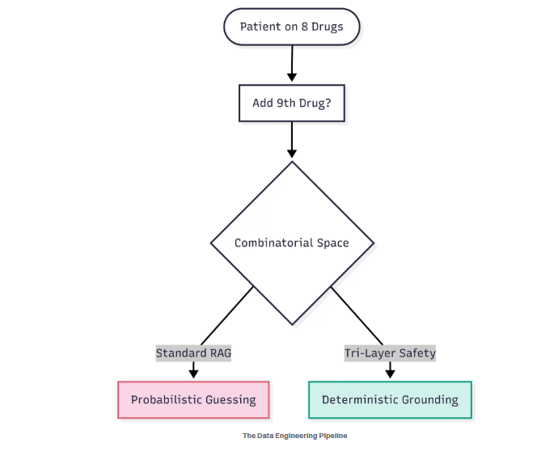
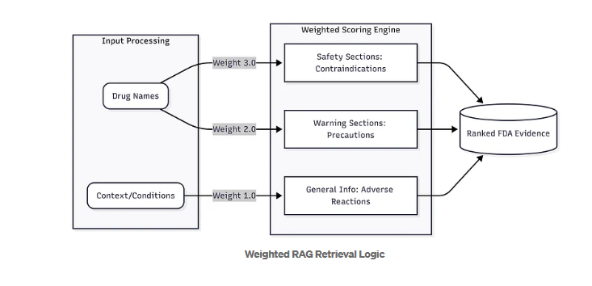
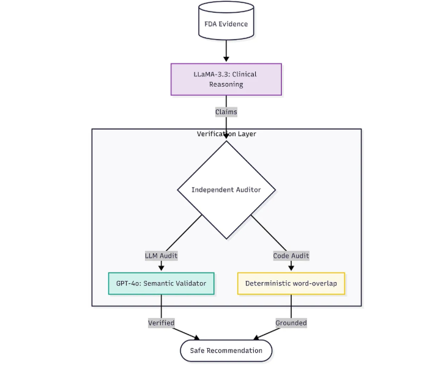
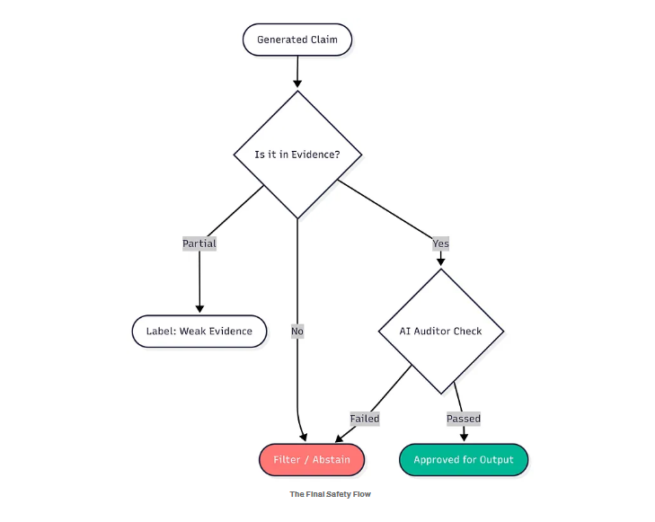
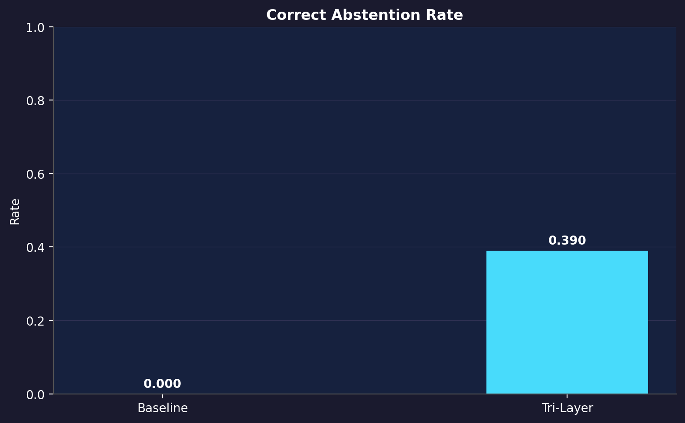
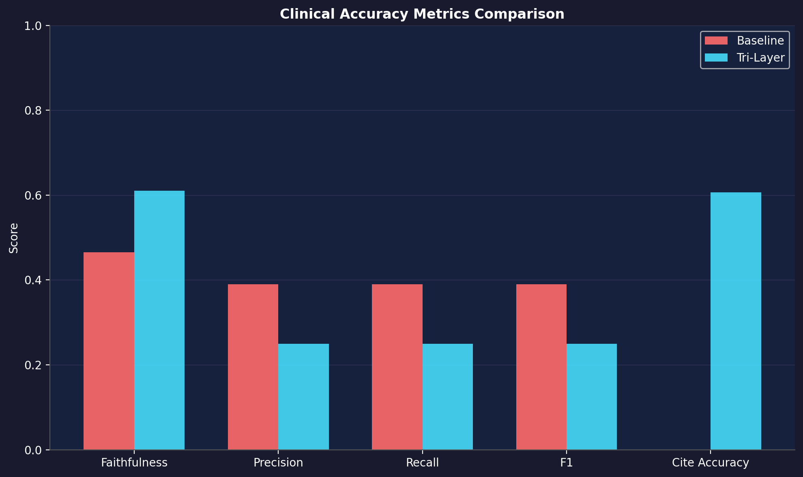
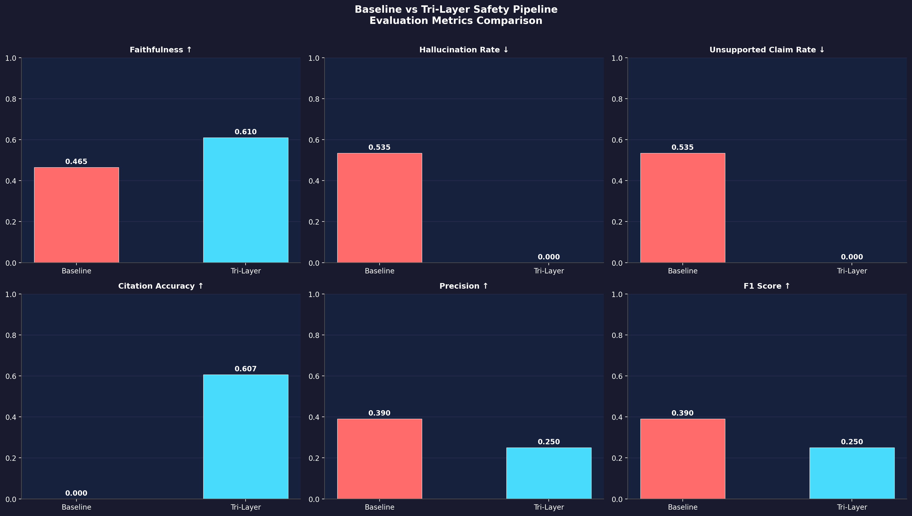
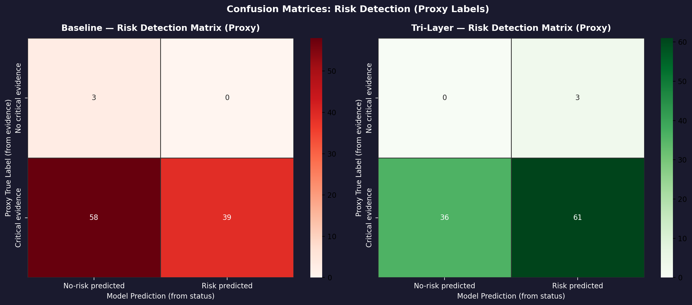
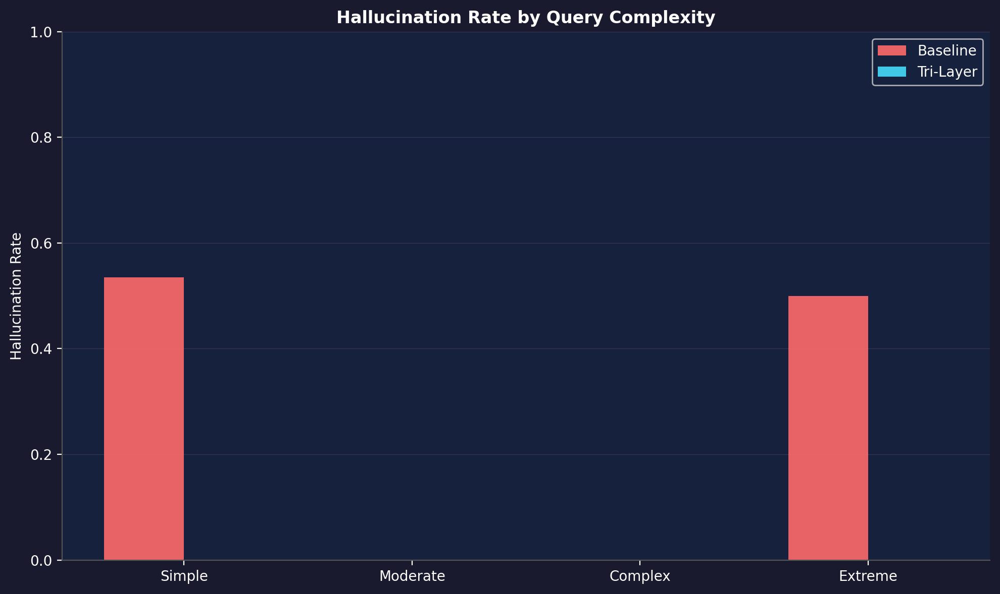

# Medical Hallucination Mitigation in Clinical AI

## Problem Statement

Large Language Models (LLMs) are powerful, but in healthcare, **accuracy is critical**.

In complex medical scenarios like **polypharmacy** (patients taking multiple medications), LLMs often:

* Miss critical drug interactions
* Hallucinate unsupported claims
* Fail under large context windows (attention dilution)

Even a small mistake in such environments can lead to serious consequences.

---

## Objective

This project focuses on building a **safety-first AI pipeline** that:

* Reduces hallucinations in medical responses
* Improves factual correctness using validated sources
* Ensures reliable decision support in high-risk scenarios

---

## The 8+1 Stress Test

We simulate a real-world scenario:

> A patient is already taking 8 high-risk drugs, and a 9th drug is introduced.

This leads to an **exponential increase in drug-drug interactions (DDIs)** — a known failure point for standard LLMs.

---

## System Architecture

The system is designed using a **multi-layer safety architecture**:

### 1. Ground Truth Engineering

* Drugs validated using **openFDA**
* Focus on safety-critical sections:

  * Contraindications
  * Drug Interactions
  * Boxed Warnings

---

### 2. Weighted RAG (Retrieval-Augmented Generation)

Instead of treating all data equally, the system assigns **clinical weights**:

* Contraindications → Highest priority
* Drug Interactions → High priority
* General information → Lower priority

This ensures the model focuses on **critical safety signals**.

---

### 3. Generator–Verifier Architecture

A dual-model system:

* **Generator** → Produces clinical reasoning and responses
* **Verifier (Auditor)** → Independently validates each claim against FDA data

The verifier has **no access to generator reasoning**, ensuring unbiased auditing.

---

### 4. Semantic Factual Decomposition

Each response is broken into **atomic medical claims**.

Every claim is:

* Checked against ground truth
* Accepted only if supported

---

### 5. Self-Abstaining Mechanism

If evidence is insufficient:

> The system responds with: *"Insufficient evidence"*

instead of making a risky guess.

---

## Results (Evaluation on 500 Queries)

### What is inside the `results/` folder?

The `results-on-500-queries/` folder contains:

* Model outputs and evaluation visuals
* Comparison of baseline vs proposed system
* Performance charts (hallucination rate, accuracy, etc.)

These results are generated from **500 high-complexity medical queries** designed to stress-test the system.

---

## What is inside the `architecture/` folder?

The `architecture/` folder contains:

* System design diagrams
* Flowcharts of the full pipeline
* Generator–Verifier interaction flow

📌 These visuals explain how the system ensures **safety and verification at every step**.

---

## Key Insight

> **AI safety is an architectural problem, not just a prompting problem.**

By separating reasoning from verification, the system significantly reduces hallucinations.

---

## Medium Article

Read the full detailed explanation here:
👉 https://moizaliafzaal.medium.com/how-i-built-a-hallucinationproof-ai-for-medical-safety-eafeb0552bf4

---

## Code Availability

The implementation code is not publicly available.

This repository is intended to:

* Showcase results
* Present system architecture
* Demonstrate research findings

---

## Impact

This work can contribute to:

* Clinical decision support systems
* Drug safety analysis platforms
* Reliable AI in high-risk healthcare environments

---

## 👤 Author

**Moiz Ali Afzaal**

---

## Disclaimer

This project is for research and demonstration purposes only.
It is not intended for real-world clinical use without proper validation.
